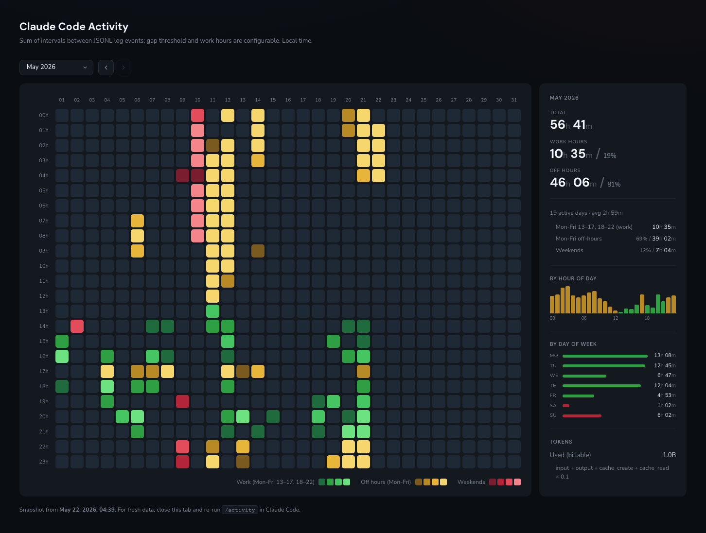

# claude-activity

A local, privacy-respecting **heatmap of your Claude Code usage** — see when
you actually worked, by hour of day × day of month, with project / session
breakdown on hover. Everything is computed on your machine from
`~/.claude/projects/**/*.jsonl`; no server, no telemetry, no external
services.



## Features

- 24 × N-day heatmap for any month with activity
- Three cell types: **work hours** (configurable), **off-hours** (weekday
  outside the work window), **weekends** — color-coded green / yellow / red
- Three big KPIs at the top of the sidebar: total · work · off
- Per-hour-of-day and per-day-of-week bar charts
- Hover tooltip shows projects + session titles + per-project time for that
  exact hour
- Daily token totals (input + output + cache, weighted) per month
- **Persistent history.json** — survives Claude Code pruning old session files
- Configurable: work days, work hours, gap threshold, first day of week,
  auto-open
- Auto-syncs in the background via `SessionStart` / `SessionEnd` hooks
- 100% local, single HTML file, opens from `file://`

## Install

### Via custom marketplace (recommended once published)

```bash
/plugin marketplace add kalatsch/claude-activity
/plugin install claude-activity@claude-activity
```

### Manual install / development symlink

```bash
git clone https://github.com/kalatsch/claude-activity.git
ln -s "$(pwd)/claude-activity" \
      ~/.claude/plugins/cache/local/claude-activity/0.1.0
```

### Standalone (no Claude Code plugin)

```bash
git clone https://github.com/kalatsch/claude-activity.git
cd claude-activity
python3 lib/generate.py            # writes ~/.claude-activity/index.html
python3 lib/generate.py --open     # also opens it in the browser
```

## Usage

Inside Claude Code:

```
/activity              # generate + open in browser
/activity --settings   # re-run the setup wizard (aliases: --setup, --config, --reconfigure)
/activity --help       # show usage and all flags
/activity --no-open    # generate without opening the browser
```

First run walks you through a short setup wizard (work days, work hours, gap
threshold, auto-open, first day of week) and saves the answers to
`~/.claude-activity/config.json`.

## Configuration

`~/.claude-activity/config.json` — edit any time and re-run `/activity`.

| Key | Default | Meaning |
|---|---|---|
| `gap_minutes` | `10` | Max gap between events that still counts as continuous activity. |
| `work_intervals` | `[[9, 18]]` | Work hours as an array of `[start, end)` pairs (0–23). Multiple pairs let you split around a lunch break, e.g. `[[9, 12], [13, 18]]`. |
| `work_days` | `[0,1,2,3,4]` | Weekday indices, `0` = Monday … `6` = Sunday. |
| `first_day_of_week` | `0` | Where the by-day-of-week chart starts. `0` = Mon, `6` = Sun. |
| `auto_open` | `true` | Open the HTML in the browser after generating. |
| `cache_read_weight` | `0.1` | Multiplier on `cache_read_input_tokens` for the "billable" tokens total. |
| `output_dir` | `"~/.claude-activity"` | Where to write `index.html` and `history.json`. |

## How it works

1. Walks every `.jsonl` under `~/.claude/projects/` (main sessions + sub-agent
   files).
2. For each consecutive pair of events whose gap is ≤ `gap_minutes`, the
   duration is attributed to the later event's project / session and split
   across hour-of-day buckets.
3. **Day categorisation** uses `work_days` + `work_intervals`:
   `work` (in-window weekday), `off` (out-of-window weekday), `wknd`
   (non-work day).
4. **Tokens**: every `assistant` event's `usage` block is summed per day.
5. Output is merged with `~/.claude-activity/history.json` so months Claude
   Code later prunes from disk are preserved in the dashboard. Merge takes
   `max` per bucket — safe across pruning and re-runs.

## Auto-sync hooks

The plugin registers two Claude Code hooks that silently keep `history.json`
fresh — you never need to remember to `/activity` just to "save" data.

| Hook | Async | Fires when |
|---|---|---|
| `SessionStart` | yes | New Claude Code session starts. Catches data the previous `SessionEnd` may have missed on an abrupt close (Cmd+Q, terminal kill, crash). |
| `SessionEnd` | no | Session closes gracefully (`/exit`, normal exit). Adds ~3 s. |

Both invoke `python3 ${CLAUDE_PLUGIN_ROOT}/lib/generate.py --no-open`. To
disable, delete `hooks/hooks.json`.

## Why a separate `history.json`

Claude Code periodically deletes older session JSONL files. Without history,
your heatmap would forget pruned months. `history.json` keeps only aggregated
per-hour numbers (~65 KB for a year of dense usage) — far cheaper than
backing up the raw 500 MB+ of JSONL.

## Comparison with `session-report` (Anthropic, official)

[`session-report`](https://github.com/anthropics/claude-plugins-official/tree/main/plugins/session-report)
is a great companion — it focuses on **what** your tokens were spent on
(top prompts, cache efficiency, subagent breakdown) over a sliding window.

`claude-activity` is complementary: it focuses on **when** you worked,
visually, across calendar months, and preserves history across pruning.

## Privacy

- Reads from `~/.claude/projects/` only.
- Writes only to `output_dir` (default `~/.claude-activity/`).
- Single static HTML opened from `file://` — no network, no logging.
- All token / session data stays on your disk.

## Requirements

- Python 3.9+ (no external Python packages required).
- A modern browser (Chrome, Safari, Firefox).

## License

MIT — see `LICENSE`.
